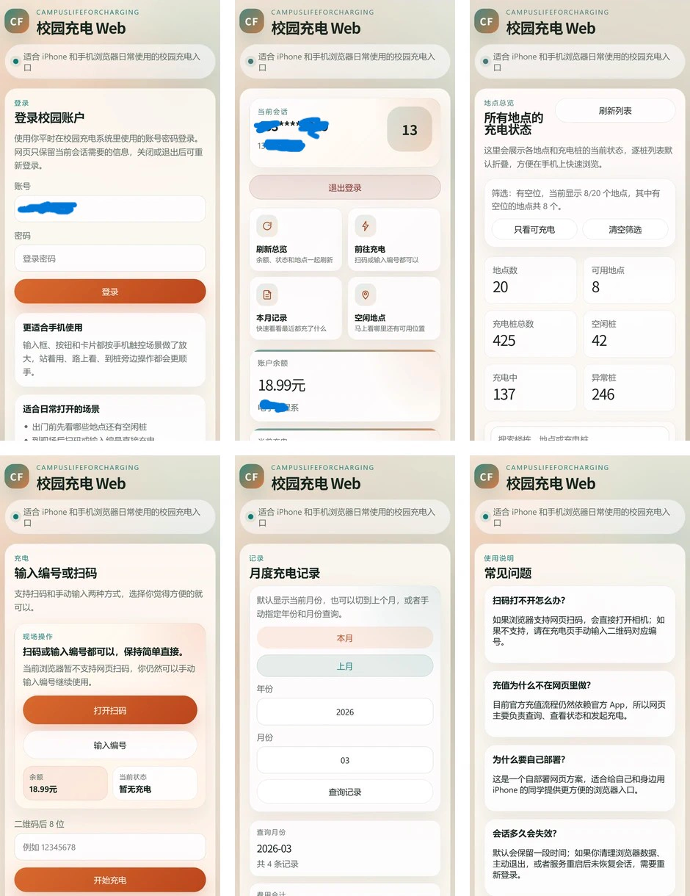

# CampusLifeForCharging

本项目为平时主用 iPhone 的用户提供了一个轻量级的校园充电网页入口，**让你在日常充电时免于携带备用的安卓手机**，只需偶尔使用安卓设备完成充值即可轻松搞定校园充电。

## 项目背景

由于“校园生活”官方 App 尚未在苹果 App Store 上架，导致广大的 iPhone 用户面临一个非常尴尬的局面：难以直接使用手机操控校园内的充电桩。在此之前，苹果手机用户如果想要充电，往往不得不每天随身多携带一台安卓手机，或者费力折腾安卓模拟器，这给日常的校园出行带来了极大的不便。

本项目正是为了解决这一痛点而生，通过在网页端复刻核心的充电功能，将 iPhone 用户从“被迫双持”的麻烦中解放出来。

## 页面预览

以下为主要页面的预览图。README 中展示的是便于浏览的总览图，点击下方链接可以查看对应的高清长图。



完整截图：[登录](./assets/screenshots/login.webp) / [仪表盘](./assets/screenshots/dashboard.webp) / [充电桩状态](./assets/screenshots/charger-status.webp) / [开始充电](./assets/screenshots/start-charging.webp) / [充电记录](./assets/screenshots/charge-records.webp) / [更多](./assets/screenshots/more.webp)

## 使用方式

整体逻辑为：**安卓端管资金，网页端管日常**。

1. **初次注册与充值**：先准备一台安卓手机（或使用安卓模拟器），安装“校园生活”官方 App，在里面完成账号注册和首次充值。
2. **日常无忧充电**：平时出门只需带上你的 iPhone！直接使用苹果手机浏览器访问你部署好的服务网址，即可在网页里完成日常操作：登录、查看状态和余额、扫码或输入编号发起充电。
3. **偶尔充值**：当账户余额不足时，再回到安卓设备上的官方 App 完成充值即可。

## 技术栈

- 前端：Vue 3 + TypeScript + Vite
- 后端：Node.js 原生 HTTP 服务
- 协议适配：保留现有校园生活上游接口封装

## 开发

需要 Node.js 18+ 环境。

```sh
npm install
cp .env.example .env
npm run dev
```

开发模式下：

- Node API 服务默认运行在 `http://127.0.0.1:8787`
- Vite 前端开发服务默认运行在 `http://127.0.0.1:5173`

## 部署

需要 Node.js 18+ 环境。

```sh
npm install
cp .env.example .env
npm run build
npm start
```

默认访问地址是 `http://127.0.0.1:8787`。如果需要公网访问，请把 `.env` 文件里的 `HOST` 修改为 `0.0.0.0`。

## 反馈

- 源码仓库：[https://github.com/JfanLiu/CampusLifeForCharging](https://github.com/JfanLiu/CampusLifeForCharging)
- 问题反馈：[https://github.com/JfanLiu/CampusLifeForCharging/issues](https://github.com/JfanLiu/CampusLifeForCharging/issues)

## 参考项目

- AltCampusLife: [https://github.com/creeper12356/AltCampusLife](https://github.com/creeper12356/AltCampusLife)
